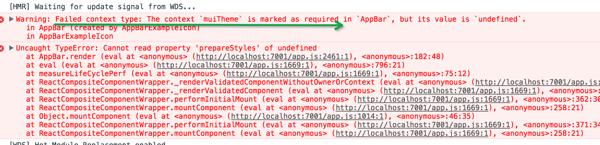

# Material-UI相关问题

相关库的版本号：
1. `"react": "^15.4.1"`
2. `"react-dom": "^15.4.1"`
3. `"react-tap-event-plugin": "^2.0.1"`
4. `"material-ui": "^0.16.0-rc2"`

## Failed context type: The context `muiTheme` is marked as required

stackoverflow地址: [http://stackoverflow.com/questions/36953711/i-cannot-use-material-ui-components-after-update-to-material-ui0-15-0-beta-1](http://stackoverflow.com/questions/36953711/i-cannot-use-material-ui-components-after-update-to-material-ui0-15-0-beta-1)

根据官网提供的demo，自己动手写就报错了:

```javascript
import React from 'react';
import {AppBar} from 'material-ui';

export class MyComponent extends React.Component {
  render() {
    return (
        <div>
        <AppBar title="Title" />
        </div>
    );
  }
}
```



需要改成这样:

```javascript
import React from 'react';
import AppBar from 'material-ui/AppBar';
import baseTheme from 'material-ui/styles/baseThemes/lightBaseTheme';
import getMuiTheme from 'material-ui/styles/getMuiTheme';

export class MyComponent extends React.Component {

  getChildContext() {
    return { muiTheme: getMuiTheme(baseTheme) };
  }

  render() {
    return (
        <div>
        <AppBar title="Title" />
        </div>
    );
  }        
}

MyComponent.childContextTypes = {
  muiTheme: React.PropTypes.object.isRequired
};
```


